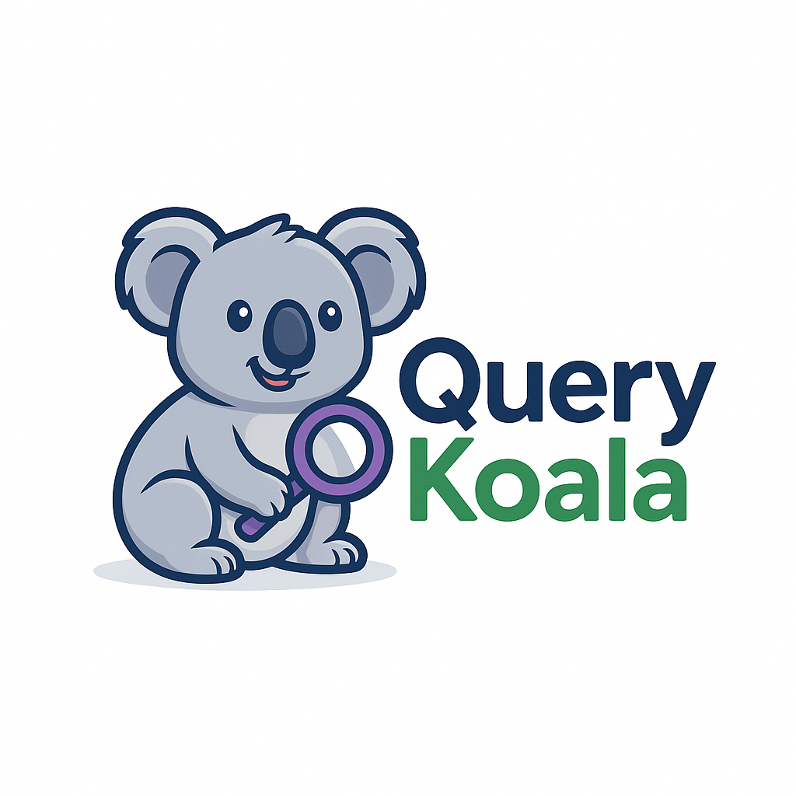
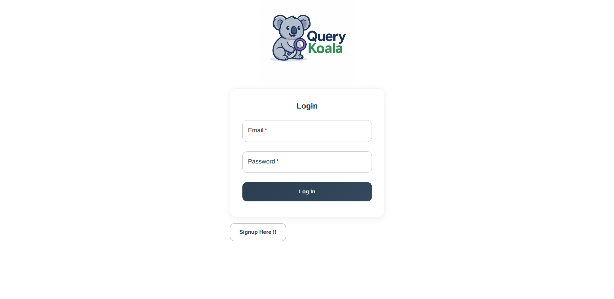
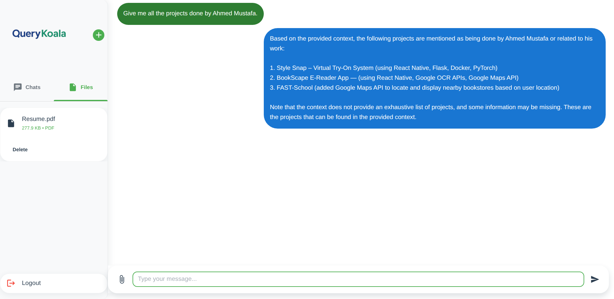

# QueryKoala - RAG Based Chatbot

<p align="center">
  
</p>

<h1 align="center">A Full-Stack RAG-Based Chatbot</h1>

QueryKoala is an intelligent, full-stack, Retrieval-Augmented Generation (RAG) based chatbot application. It allows users to upload documents and ask questions about their content. The application is built with a modern tech stack, featuring a React frontend and a Python backend.

## 🎥 Video Demonstration

https://www.loom.com/embed/e7b6c7fa61d14b59afbc0c61811d8fea?sid=0f070b9e-5bf0-402a-ab60-0434899bf181

## 📸 Screenshots

### Login Page



### Chat Interface



## ✨ Features

- **User Authentication:** Secure user login and registration.
- **File Upload:** Users can upload PDF documents to the application.
- **Chat Interface:** An intuitive chat interface to interact with the chatbot.
- **RAG-Based Q&A:** Ask questions about the uploaded documents and get intelligent answers.
- **Chat History:** View previous chat sessions.
- **File Management:** View and manage uploaded files.

## 🛠️ Tech Stack

### Frontend

- **ReactJS:** A JavaScript library for building user interfaces.
- **Material-UI (MUI):** A popular React UI framework for faster and easier web development.
- **Tanstack Query:** A powerful data synchronization library for React.
- **Vite:** A modern frontend build tool that significantly improves the development experience.

### Backend

- **FastAPI:** A modern, fast (high-performance), web framework for building APIs with Python.
- **Langchain:** A framework for developing applications powered by language models.
- **Pinecone:** A vector database for similarity search.
- **PostgreSQL:** A powerful, open-source object-relational database system.

## 🚀 Getting Started

### Prerequisites

- Node.js and npm
- Python 3.8+ and pip
- PostgreSQL database

### Installation and Setup

1.  **Clone the repository:**

    ```bash
    git clone https://github.com/your-username/rag-chatbot.git
    cd rag-chatbot
    ```

2.  **Install frontend dependencies:**

    ```bash
    npm install
    ```

3.  **Start the frontend development server:**

    ```bash
    npm run dev
    ```

4.  **Set up the backend:** (Assuming you have the backend code in a separate directory)
    - Install Python dependencies:
      ```bash
      pip install -r requirements.txt
      ```
    - Set up your environment variables for the database, Pinecone, etc.
    - Run the FastAPI server:
      ```bash
      uvicorn main:app --reload
      ```

## 📝 License

This project is licensed under the MIT License - see the [LICENSE](LICENSE) file for details.
